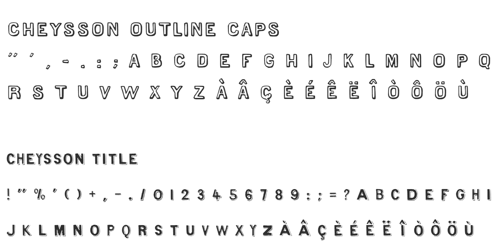

<!-- badges: start -->
[](https://lifecycle.r-lib.org/articles/stages.html#experimental)
<!-- badges: end -->

# ggCheysson 


The `ggCheysson` package aims to bring the graphical styles of the
_Albums de Statistique Graphique_, produced by the Ministry of Public Works
in France under the direction of [Émile Cheysson](https://en.wikipedia.org/wiki/%C3%89mile_Cheysson), to R within the `ggplot2` framework for producing
maps and graphs. These consist of:

* **colors and fill patterns** used in various maps to portray quantitative variables with a sequential or diverging pallete, and hatching patterns to convey quantity within a given color
* **Cheysson fonts** to reflect some character of the hand-drawn style used in these images.

At present, it is just a work-in-progress, awaiting translation from the original sources
to R, most likely using the framework of the 
[ggpattern](https://coolbutuseless.github.io/package/ggpattern/) and
[ggthemes](https://jrnold.github.io/ggthemes/).  
This README simply documents the sources and steps so far.

### Sources

* David Rumsey acquired the complete set of the _Albums de Statistique Graphique_, and placed
them online in the [David Rumsey Map Collection](https://www.davidrumsey.com/luna/servlet/view/search?sort=Pub_List_No_InitialSort%2CPub_Date%2CPub_List_No%2CSeries_No&q=album+de+statistique&search=Go)

* From this, RJ Andrews, [Classic Map Color Design: Recreating palettes from the _Albums de Statistique Graphique._](https://infowetrust.com/project/album-colors), identified 25 maps from the
Albums, containing a variety of colors and fill patterns. He then constructed SVG
patterns in this [Github repo](https://github.com/infowetrust/albumcolors).

* Tom Shanley, [Cheysson Color Palettes](https://observablehq.com/@tomshanley/cheysson-color-palettes). A collection of
SVG colors and patterns for [Observable](https://observablehq.com).

* Kenneth Fields, [The style of Émile Cheysson](https://www.esri.com/arcgis-blog/products/arcgis-pro/mapping/the-style-of-emile-cheysson/), packages these for [ArcGIS Pro](https://www.esri.com/en-us/arcgis/products/arcgis-pro/overview).

### Colors and fill patterns

The 25 maps use a variety of sequential, diverging and categorical palettes. These are named
for the album year and plate number in  the figure below, for example **1880 map 7** for the
upper left figure.


RJ Andrews abstracted the color and patterns from these images into SVG files, represented
in the figure below. He named these according to days of an Advent calendar, 
so, for example, the palette for the image "1880 map 07" was published for Advent Day Dec. 06,
and is labeled "Dec.06-1880.07".


Tom Shanley used these SVG files for his [Cheysson Color Palettes](https://observablehq.com/@tomshanley/cheysson-color-palettes), and unfortunately named
them according to RJ's Advent Days. These are contained in the `data-raw/observable/` folder,
with names like `dec06.txt`, for the palette of the 1880 Map 7.


### Fonts

Kenneth Fields created a set of five fonts to mimic the hand drawn lettering used
in the _Albums_. The reside in the `fonts/` directory as `.ttf` files, and consist of
`Cheysson Regular`, `Cheysson Italic`, `Cheysson Sans Caps`, `Cheysson Outline Caps`,
and `Cheysson Title`.

  


**TODO**: Figure out if these fonts can be installed from the package, or give instructions.

## Installation

There's not much here yet, but you can install the development version of `ggCheysson` like so:

``` r
remotes::install.github("friendly/ggCheysson")
```

## Example

This is a basic example which illustrates that there's not much that can be done yet.

``` r
library(ggCheysson)
## basic example code
```

