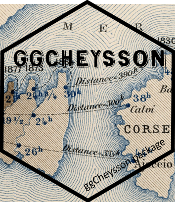
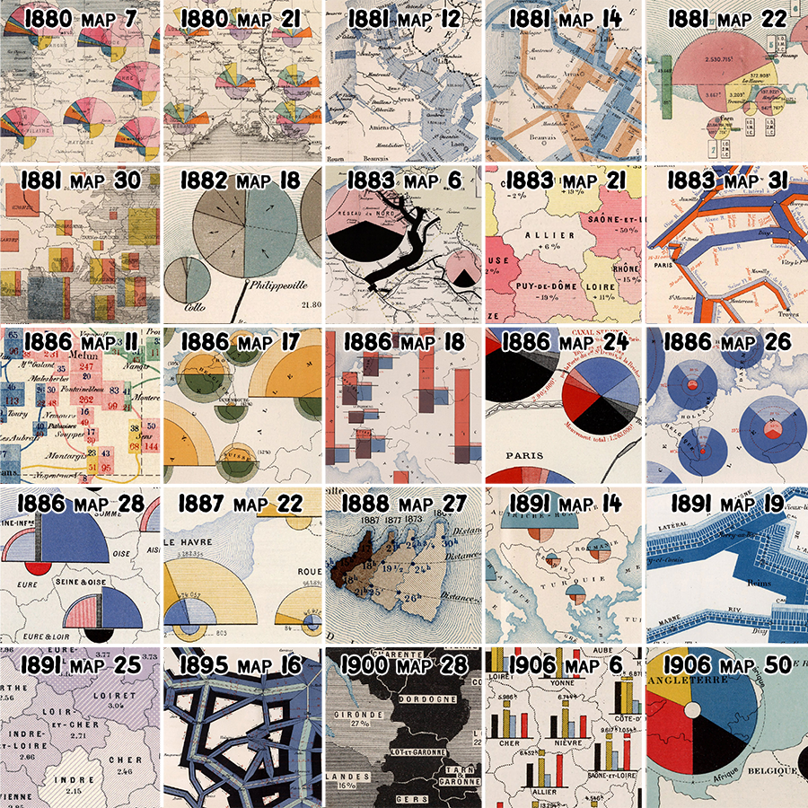
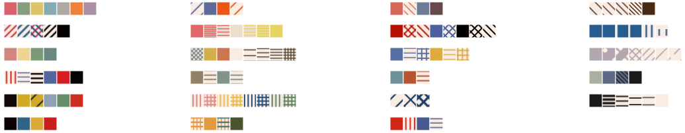
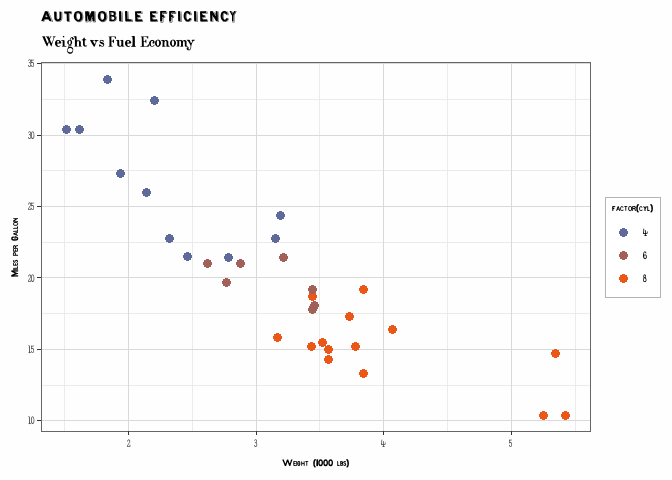
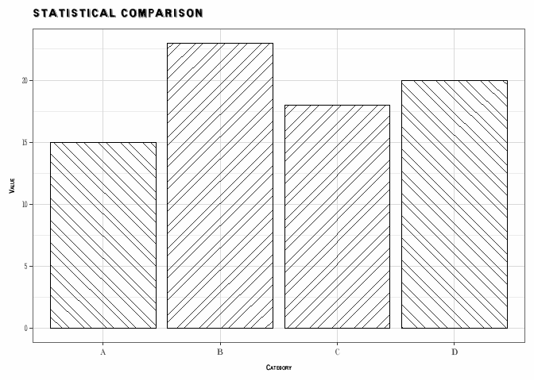
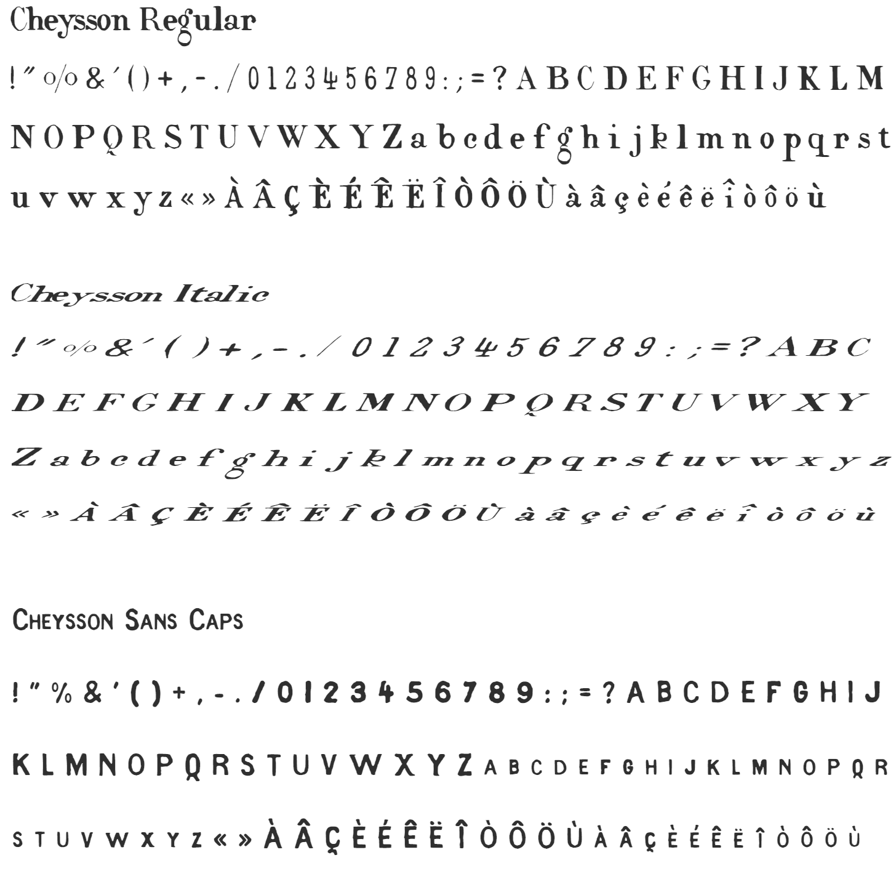
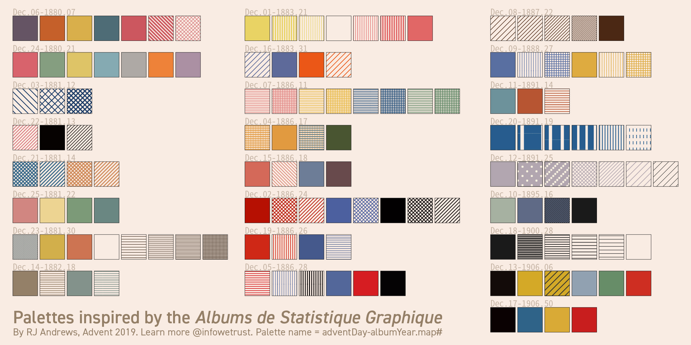

<!-- README.md is generated from README.Rmd. Please edit that file -->

<!-- badges: start -->

[](https://cran.r-project.org/package=ggCheysson)
[](https://github.com/friendly/ggCheysson)
[](https://lifecycle.r-lib.org/articles/stages.html#experimental)
<!-- badges: end -->

# ggCheysson 

The `ggCheysson` package brings the graphical styles of the *Albums de
Statistique Graphique* to R and ggplot2.

The *Albums* were produced by the Ministry of Public Works in France
under the direction of [Émile
Cheysson](https://en.wikipedia.org/wiki/%C3%89mile_Cheysson) from
1879-1897. They represent the “pinnacle of the Golden Age of Statistical
Graphics” (Friendly, 2008) for their innovation in visualization
techniques, graphic design and beauty.

The package is based on work by:

- David Rumsey Map Collection: Complete digitized *Albums de Statistique
  Graphique* [View
  collection](https://www.davidrumsey.com/luna/servlet/view/search?q=album+de+statistique)
- RJ Andrews: [Classic Map Color
  Design](https://infowetrust.com/project/album-colors) \|
  [GitHub](https://github.com/infowetrust/albumcolors)
- Tom Shanley: Observable implementation [Cheysson Color
  Palettes](https://observablehq.com/@tomshanley/cheysson-color-palettes)
- Kenneth Fields: Hand-drawn font family creation [The style of Émile
  Cheysson](https://www.esri.com/arcgis-blog/products/arcgis-pro/mapping/the-style-of-emile-cheysson/)

## Historical Context

The *Albums de Statistique Graphique* were published annually by
France’s Ministry of Public Works, showcasing infrastructure statistics
through innovative visualizations. Under Émile Cheysson’s direction,
these albums combined:

- Sophisticated use of color to represent quantitative variables
- Hatching patterns to differentiate categories and show density
- Hand-lettered text with distinctive character
- Clear hierarchical organization of information

This package preserves these design elements for modern statistical
graphics.

## Installation

Install the development version from GitHub:

``` r
# install.packages("remotes")
remotes::install_github("friendly/ggCheysson")
```

### Suggested Dependencies

For full functionality, install these packages:

``` r
install.packages(c("ggpattern", "systemfonts"))
```

## Features

This package provides a complete aesthetic system for creating
visualizations in Cheysson’s distinctive style:

### 🎨 Color Palettes

- **20 authentic color palettes** extracted from the original Albums
- Sequential, diverging, grouped, and categorical palette types
- Named by album year and plate number (e.g., `1880_07`, `1881_03`)
- Compatible with standard ggplot2 color scales

### 📐 Hatching Patterns

- **83 pattern specifications** including solid fills, stripes, and
  crosshatching
- Line angles (0°, 45°, 90°, 135°) matching historical diagrams
- Variable densities and line widths
- Full integration with
  [ggpattern](https://coolbutuseless.github.io/package/ggpattern/)

### ✍️ Authentic Fonts

- **5 hand-drawn font families** replicating Cheysson’s lettering style
- Regular, Italic, Sans Caps, Outline Caps, and Title variants
- Automatic loading and integration with ggplot2 themes
- Created by Kenneth Fields for historical accuracy

### 🎭 Complete Themes

- `theme_cheysson()` - Full period-appropriate theme
- `theme_cheysson_minimal()` - Minimal grid variant
- `theme_cheysson_map()` - Optimized for cartographic work

These were derived by RJ Andrews from a collection of 25 thematic maps
across the span of years in which the *Albums* were produced, shown
below.

<center>


</center>

From these, he abstracted the following combinations of color and
pattern he thought characterized these maps:

<center>


</center>

### Not Yet

This initial version of the package defines separate functions and
`ggplot2` scales for color palettes and shading patterns. Their
combination into Cheysson “color - pattern” features is planned.

## Quick Start

Here are a few examples to get you started.

### Basic Color Palette

Use the color palette of the 1881 Album, plate 4

``` r
library(ggplot2)
library(ggCheysson)

ggplot(iris, aes(Sepal.Length, Sepal.Width, color = Species)) +
  geom_point(size = 3) +
  scale_color_cheysson("1881_04") +
  labs(title = "Iris Dataset") +
  theme_minimal()
```


### With Fonts and Theme

``` r
# Load Cheysson fonts (once per session)
load_cheysson_fonts(method = "showtext")
# Enable showtext for rendering
showtext::showtext_auto()

ggplot(mtcars, aes(wt, mpg, color = factor(cyl))) +
  geom_point(size = 3) +
  scale_color_cheysson("1883_04") +
  labs(
    title = "Automobile Efficiency",
    subtitle = "Weight vs Fuel Economy",
    x = "Weight (1000 lbs)",
    y = "Miles per Gallon"
  ) +
  theme_cheysson()
```



### Complete Cheysson Aesthetic (Colors + Patterns + Fonts)

``` r
library(ggpattern)

data <- data.frame(
  category = LETTERS[1:4],
  value = c(15, 23, 18, 20)
)

ggplot(data, aes(category, value, fill = category)) +
  geom_col_pattern(
    aes(
      pattern_type = category,
      pattern_fill = category,
      pattern_angle = category
    ),
    pattern = "stripe",
    pattern_density = 0.35,
    color = "black"
  ) +
  scale_fill_cheysson_pattern("1881_03") +
  scale_pattern_fill_cheysson("1881_03") +
  scale_pattern_type_cheysson("1881_03") +
  scale_pattern_angle_cheysson("1881_03") +
  labs(
    title = "Statistical Comparison",
    x = "Category",
    y = "Value"
  ) +
  theme_cheysson() +
  theme(legend.position = "none")
```



## Available Palettes

View all available palettes:

``` r
# List all palettes
list_cheysson_pals()
#>       name       type album plate n_colors
#> 1  1880_07   category  1880     7        7
#> 2  1881_03 sequential  1881     3        1
#> 3  1881_04   category  1881     4        4
#> 4  1881_08    grouped  1881     8        5
#> 5  1882_04    grouped  1882     4        2
#> 6  1883_04  diverging  1883     4        2
#> 7  1883_06   category  1883     6        4
#> 8  1883_07  diverging  1883     7        3
#> 9  1886_04 sequential  1886     4        2
#> 10 1886_07   category  1886     7        3
#> 11 1886_08    grouped  1886     8        4
#> 12 1887_06    grouped  1887     6        2
#> 13 1888_05 sequential  1888     5        1
#> 14 1891_03    grouped  1891     3        2
#> 15 1891_06 sequential  1891     6        1
#> 16 1891_07 sequential  1891     7        2
#> 17 1895_04 sequential  1895     4        3
#> 18 1900_06 sequential  1900     6        2
#> 19 1906_04   category  1906     4        4
#> 20 1906_06   category  1906     6        6

# List by type
list_cheysson_pals("sequential")
#>      name       type album plate n_colors
#> 1 1881_03 sequential  1881     3        1
#> 2 1886_04 sequential  1886     4        2
#> 3 1888_05 sequential  1888     5        1
#> 4 1891_06 sequential  1891     6        1
#> 5 1891_07 sequential  1891     7        2
#> 6 1895_04 sequential  1895     4        3
#> 7 1900_06 sequential  1900     6        2
```

``` r
# View palette colors
cheysson_pal("1880_07")
#> [1] "#d9636c" "#869e80" "#dec367" "#85aab1" "#aea9a4" "#ed8238" "#ab90a4"
```

Palette types:

- **Sequential** (7 palettes): For ordered quantitative data
- **Diverging** (2 palettes): For data with neutral midpoint
- **Grouped** (5 palettes): For comparing related groups
- **Category** (6 palettes): For categorical data

## Pattern Support

With ggpattern, recreate the distinctive hatching styles:

``` r
# List available pattern palettes
list_cheysson_patterns()

# Get pattern specifications
patterns <- cheysson_pattern("1881_03")

# Use in plots with pattern scales
scale_pattern_fill_cheysson("1881_03")
scale_pattern_type_cheysson("1881_03")
scale_pattern_angle_cheysson("1881_03")
```

## Font Families

Five Cheysson font families are included:

| Family                | Description    | Use               |
|-----------------------|----------------|-------------------|
| `Cheysson`            | Regular serif  | Body text, labels |
| `CheyssonItalic`      | Italic variant | Emphasis          |
| `CheyssonSansCaps`    | Sans capitals  | Axis titles       |
| `CheyssonOutlineCaps` | Outlined caps  | Decorative titles |
| `CheyssonTitle`       | Display font   | Main titles       |

Here are some of these:

<center>


</center>

To use these:

``` r
# Load fonts
load_cheysson_fonts(method = "showtext")
showtext::showtext_auto()

# List available fonts
list_cheysson_fonts()

# Use specific fonts
theme(
  plot.title = element_text(family = "CheyssonTitle"),
  axis.title = element_text(family = "CheyssonSansCaps"),
  axis.text = element_text(family = "Cheysson")
)
```

## Package Contents

### Data

- `cheysson_palettes` - Color palette specifications (20 palettes)
- `cheysson_patterns` - Pattern/hatching specifications (83 patterns)
- `albumImages` - Metadata linking palettes to original album plates

### Color Functions

- `cheysson_pal()` - Get colors from a palette
- `scale_color_cheysson()` / `scale_fill_cheysson()` - ggplot2 color
  scales
- `list_cheysson_pals()` - List available palettes

### Pattern Functions

- `cheysson_pattern()` - Get pattern specifications
- `scale_pattern_*_cheysson()` - ggpattern scales for fills, types,
  angles, densities
- `list_cheysson_patterns()` - List available pattern palettes

### Font Functions

- `load_cheysson_fonts()` - Load font families
- `cheysson_font()` - Get font family names
- `list_cheysson_fonts()` - View font information
- `cheysson_fonts_available()` - Check font availability

### Themes

- `theme_cheysson()` - Complete Cheysson theme
- `theme_cheysson_minimal()` - Minimal variant
- `theme_cheysson_map()` - For maps

## Sources and Attribution

### Color Palettes and Patterns

- **David Rumsey Map Collection**: Complete digitized *Albums de
  Statistique Graphique* [View
  collection](https://www.davidrumsey.com/luna/servlet/view/search?q=album+de+statistique)

- **RJ Andrews**: SVG pattern extraction and digitization [Classic Map
  Color Design](https://infowetrust.com/project/album-colors) \|
  [GitHub](https://github.com/infowetrust/albumcolors)

- **Tom Shanley**: Observable implementation [Cheysson Color
  Palettes](https://observablehq.com/@tomshanley/cheysson-color-palettes)

### Fonts

- **Kenneth Fields**: Hand-drawn font family creation [The style of
  Émile
  Cheysson](https://www.esri.com/arcgis-blog/products/arcgis-pro/mapping/the-style-of-emile-cheysson/)

## Gallery


*Original maps from the Albums showing the variety of colors and
patterns*



*Extracted color palettes by RJ Andrews*

## Development Status

This package is under active development. Current features are stable
and tested, but the API may evolve. Feedback and contributions are
welcome!

## Related Packages

- [ggpattern](https://coolbutuseless.github.io/package/ggpattern/) -
  Pattern fills for ggplot2
- [ggthemes](https://jrnold.github.io/ggthemes/) - Additional themes for
  ggplot2
- [systemfonts](https://github.com/r-lib/systemfonts) - Font handling
  for R

## License

GPL (\>= 3)

## Citation

To cite `ggCheysson`, please use:

``` r
citation("ggCheysson")
#> To cite package 'ggCheysson' in publications use:
#> 
#>   Friendly M (2025). _ggCheysson: Styles of Emile Cheysson for
#>   ggplot2_. R package version 1.0.0,
#>   <https://github.com/friendly/ggCheysson>.
#> 
#> A BibTeX entry for LaTeX users is
#> 
#>   @Manual{,
#>     title = {ggCheysson: Styles of Emile Cheysson for ggplot2},
#>     author = {Michael Friendly},
#>     year = {2025},
#>     note = {R package version 1.0.0},
#>     url = {https://github.com/friendly/ggCheysson},
#>   }
```

To cite the original *Albums de Statistique Graphique*:

> France. Ministère des travaux publics. *Album de statistique graphique
> de \[year\]*. Paris: Imprimerie nationale, \[1879-1897\].

## References

Friendly, M. (2008). The Golden Age of Statistical Graphics.
*Statistical Science*, **23**(4), 502–535.
<https://doi.org/10.1214/08-STS268>
