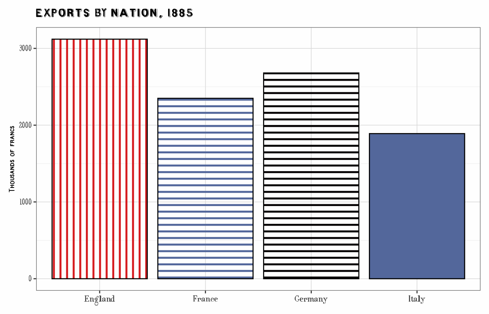
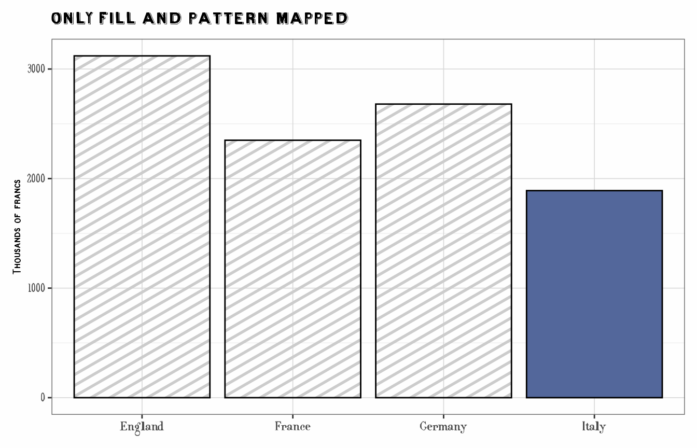
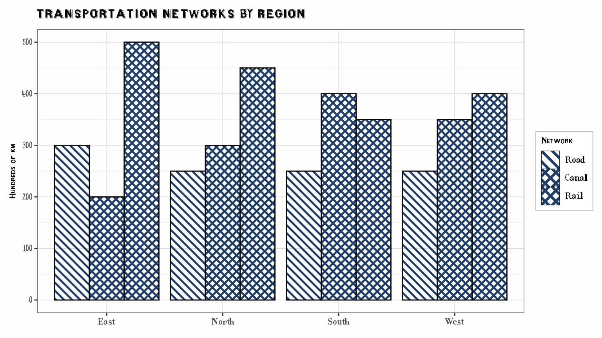
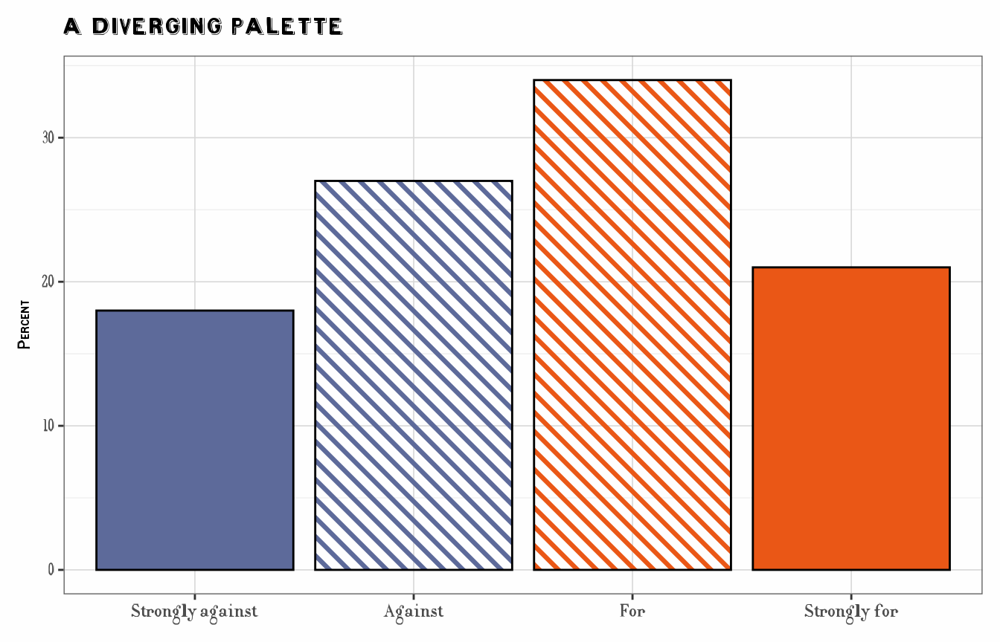
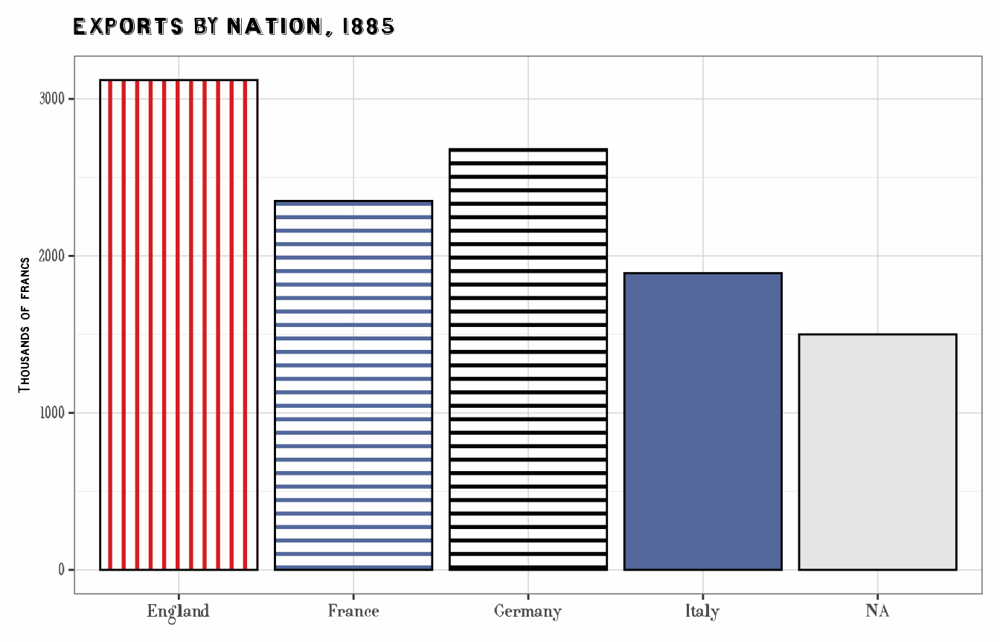
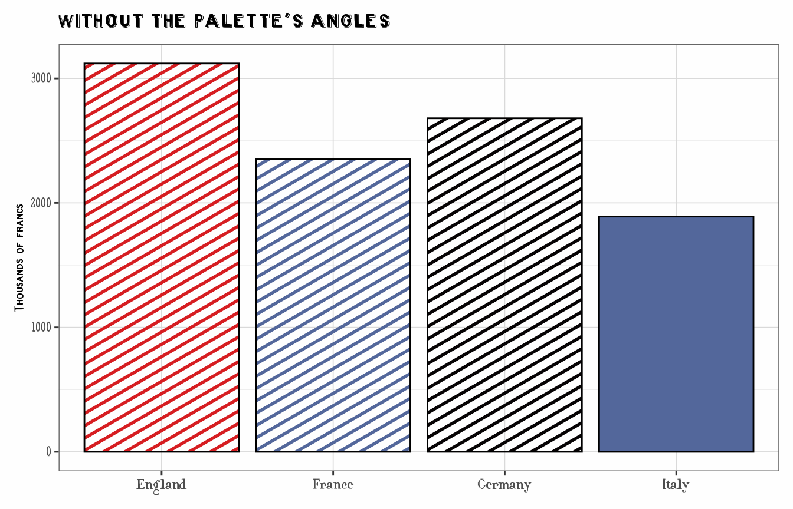

# Combining Colors and Patterns

**Experimental.** The functions described here,
[`scale_cheysson()`](https://friendly.github.io/ggCheysson/reference/scale_cheysson.md)
and
[`aes_cheysson()`](https://friendly.github.io/ggCheysson/reference/scale_cheysson.md),
are new in ggCheysson 1.1.0, and their interface may change in a future
version.

``` r
library(ggCheysson)
library(ggplot2)
library(ggpattern)
```

## Palettes that combine color and hatching

In the *Albums de Statistique Graphique*, a class on a map or a bar in a
chart was rarely distinguished by color alone. Cheysson’s palettes
combine colors with hatching: solid fills, stripes at different angles
and spacings, and crosshatching, sometimes in two colors.

Each element of a palette in `cheysson_patterns` is therefore a small
bundle of properties. Here are the six elements of palette `1886_28`:

``` r
pats <- cheysson_pattern("1886_28")
data.frame(
  pattern       = cheysson_pattern_params(pats, "pattern_type"),
  fill          = cheysson_pattern_params(pats, "fill"),
  pattern_fill  = cheysson_pattern_params(pats, "pattern_fill"),
  pattern_fill2 = cheysson_pattern_params(pats, "pattern_fill2"),
  pattern_angle = cheysson_pattern_params(pats, "pattern_angle")
)
#>   pattern        fill pattern_fill pattern_fill2 pattern_angle
#> 1  stripe transparent      #d61d21       #d61d21            90
#> 2  stripe transparent      #53679b       #53679b             0
#> 3  stripe transparent      #060304       #060304             0
#> 4    none     #53679b      #53679b       #53679b            45
#> 5    none     #d61d21      #d61d21       #d61d21            45
#> 6    none     #060304      #060304       #060304            45
```

- `pattern`: the hatch type, `"none"` for a solid fill
- `fill`: the paper or fill color behind the hatching (`"transparent"`
  for hatching on bare paper)
- `pattern_fill`: the color of the hatch lines
- `pattern_fill2`: the color of a crosshatch’s second set of lines (the
  same as `pattern_fill` except in two-color crosshatches)
- `pattern_angle`: the angle of the lines

## The long way: one mapping and one scale per property

In `ggplot2` with `ggpattern`, each of these properties is a separate
aesthetic. To apply a palette to a variable, each aesthetic needs both a
**mapping** in
[`aes()`](https://ggplot2.tidyverse.org/reference/aes.html) and a
**scale** that supplies its values:

``` r
trade <- data.frame(
  country = c("France", "England", "Germany", "Italy"),
  exports = c(2350, 3120, 2680, 1890)
)

ggplot(trade, aes(country, exports)) +
  geom_col_pattern(
    aes(fill = country, pattern = country, pattern_fill = country,
        pattern_fill2 = country, pattern_angle = country),
    pattern_colour = NA, pattern_density = 0.3, pattern_spacing = 0.025,
    colour = "black"
  ) +
  scale_fill_cheysson_pattern("1886_28") +
  scale_pattern_type_cheysson("1886_28") +
  scale_pattern_fill_cheysson("1886_28") +
  scale_pattern_fill2_cheysson("1886_28") +
  scale_pattern_angle_cheysson("1886_28") +
  labs(title = "Exports by Nation, 1885", x = NULL, y = "Thousands of francs") +
  theme_cheysson() +
  theme(legend.position = "none")
```



## The short way: `aes_cheysson()` and `scale_cheysson()`

Two functions collapse the five mappings and the five scales to one line
each:

- `aes_cheysson(country)` maps `country` to all five aesthetics. Other
  mappings can be given as further arguments,
  e.g. `aes_cheysson(country, x = year, y = value)`.
- `scale_cheysson("1886_28")` returns the five scales as a list, which
  `+` adds to the plot in one step. All of them take their values from
  the same palette elements, so each level of `country` gets one
  complete historical swatch.

This draws the same plot as above:

``` r
ggplot(trade, aes(country, exports)) +
  geom_col_pattern(
    aes_cheysson(country),
    pattern_colour = NA, pattern_density = 0.3, pattern_spacing = 0.025,
    colour = "black"
  ) +
  scale_cheysson("1886_28") +
  labs(title = "Exports by Nation, 1885", x = NULL, y = "Thousands of francs") +
  theme_cheysson() +
  theme(legend.position = "none")
```


Settings that are better fixed than mapped stay in the geom:
`pattern_density` and `pattern_spacing` (how thick and how close the
lines are), `pattern_colour = NA` (no outlines around the hatch lines),
and the outline `colour`.

### Why both are needed

A scale does nothing for an aesthetic the plot doesn’t map. Here only
`fill` and `pattern` are mapped, so
[`scale_cheysson()`](https://friendly.github.io/ggCheysson/reference/scale_cheysson.md)’s
other scales have no effect, and `ggpattern` falls back to its default
grey hatch lines and angle:

``` r
ggplot(trade, aes(country, exports, fill = country, pattern = country)) +
  geom_col_pattern(pattern_colour = NA, pattern_density = 0.3, pattern_spacing = 0.025,
                   colour = "black") +
  scale_cheysson("1886_28") +
  labs(title = "Only fill and pattern mapped", x = NULL, y = "Thousands of francs") +
  theme_cheysson() +
  theme(legend.position = "none")
```



## Legends

Arguments to
[`scale_cheysson()`](https://friendly.github.io/ggCheysson/reference/scale_cheysson.md)
such as `name` and `labels` are passed to every scale. With the same
title, `ggplot2` merges the legends of all the aesthetics into one,
whose keys show the full swatches. Here a sequential palette, `1881_12`,
whose three steps are hatchings of increasing density in a single color,
distinguishes three kinds of transport:

``` r
infrastructure <- data.frame(
  region = rep(c("North", "South", "East", "West"), each = 3),
  type   = factor(rep(c("Road", "Canal", "Rail"), 4), levels = c("Road", "Canal", "Rail")),
  length = c(250, 300, 450,  250, 400, 350,  300, 200, 500,  250, 350, 400)
)

ggplot(infrastructure, aes(region, length)) +
  geom_col_pattern(
    aes_cheysson(type),
    position = "dodge",
    pattern_colour = NA, pattern_density = 0.35, pattern_spacing = 0.02,
    colour = "black"
  ) +
  scale_cheysson("1881_12", name = "Network") +
  labs(title = "Transportation Networks by Region", x = NULL, y = "Hundreds of km") +
  theme_cheysson()
```



## Ordered data: sequential and diverging palettes

Sequential palettes are stored from low to high (light to dark), and
diverging palettes from one extreme through the middle to the other, so
`reverse = TRUE` flips every palette the same way. When the data have
fewer levels than the palette has elements, the scales pick elements
spread over the whole palette, keeping both ends.

Palette `1883_31` is diverging: two hues, each used solid and hatched.
As in Cheysson’s maps, the solid fills mark the extremes and the hatched
versions the milder classes:

``` r
opinion <- data.frame(
  response = factor(c("Strongly against", "Against", "For", "Strongly for"),
                    levels = c("Strongly against", "Against", "For", "Strongly for")),
  percent = c(18, 27, 34, 21)
)

ggplot(opinion, aes(response, percent)) +
  geom_col_pattern(
    aes_cheysson(response),
    pattern_colour = NA, pattern_density = 0.35, pattern_spacing = 0.025,
    colour = "black"
  ) +
  scale_cheysson("1883_31") +
  labs(title = "A Diverging Palette", x = NULL, y = "Percent") +
  theme_cheysson() +
  theme(legend.position = "none")
```



## Missing values

Missing values get no hatching and a plain fill, set by `na.value`
(default `"grey80"`):

``` r
trade_na <- rbind(trade, data.frame(country = NA, exports = 1500))

ggplot(trade_na, aes(country, exports)) +
  geom_col_pattern(
    aes_cheysson(country),
    pattern_colour = NA, pattern_density = 0.3, pattern_spacing = 0.025,
    colour = "black"
  ) +
  scale_cheysson("1886_28", na.value = "grey90") +
  labs(title = "Exports by Nation, 1885", x = NULL, y = "Thousands of francs") +
  theme_cheysson() +
  theme(legend.position = "none")
```



## Applying only some aesthetics

To use only some of the palette’s properties, choose them with
`aesthetics`, and map only those. Here the bars keep the palette’s hatch
types and line colors, but not its angles:

``` r
ggplot(trade, aes(country, exports, fill = country, pattern = country,
                  pattern_fill = country)) +
  geom_col_pattern(pattern_colour = NA, pattern_density = 0.3, pattern_spacing = 0.025,
                   colour = "black") +
  scale_cheysson("1886_28", aesthetics = c("fill", "pattern", "pattern_fill")) +
  labs(title = "Without the palette's angles", x = NULL, y = "Thousands of francs") +
  theme_cheysson() +
  theme(legend.position = "none")
```



The individual scales,
[`scale_fill_cheysson_pattern()`](https://friendly.github.io/ggCheysson/reference/scale_fill_cheysson_pattern.md)
and the `scale_pattern_*_cheysson()` family, remain available for full
control over each aesthetic.

## What is not included

- `pattern_density` and `pattern_spacing` are not mapped by
  [`aes_cheysson()`](https://friendly.github.io/ggCheysson/reference/scale_cheysson.md)
  or set by
  [`scale_cheysson()`](https://friendly.github.io/ggCheysson/reference/scale_cheysson.md).
  The palettes’ spacings were measured on Cheysson’s small swatches and
  need rescaling for a full-size plot; see the literacy map in
  [`vignette("guerry-maps", package = "ggCheysson")`](https://friendly.github.io/ggCheysson/articles/guerry-maps.md)
  for mapping `pattern_spacing` with
  [`scale_pattern_spacing_manual()`](https://trevorldavis.com/R/ggpattern/reference/scale_pattern_manual.html).
- The scales are discrete. For continuous data, cut it into classes
  first, as Cheysson did.
- For plots without patterns
  ([`geom_col()`](https://ggplot2.tidyverse.org/reference/geom_bar.html),
  [`geom_point()`](https://ggplot2.tidyverse.org/reference/geom_point.html),
  …), use
  [`scale_fill_cheysson()`](https://friendly.github.io/ggCheysson/reference/scale_color_cheysson.md)
  and
  [`scale_color_cheysson()`](https://friendly.github.io/ggCheysson/reference/scale_color_cheysson.md),
  which use the palettes’ colors only.
