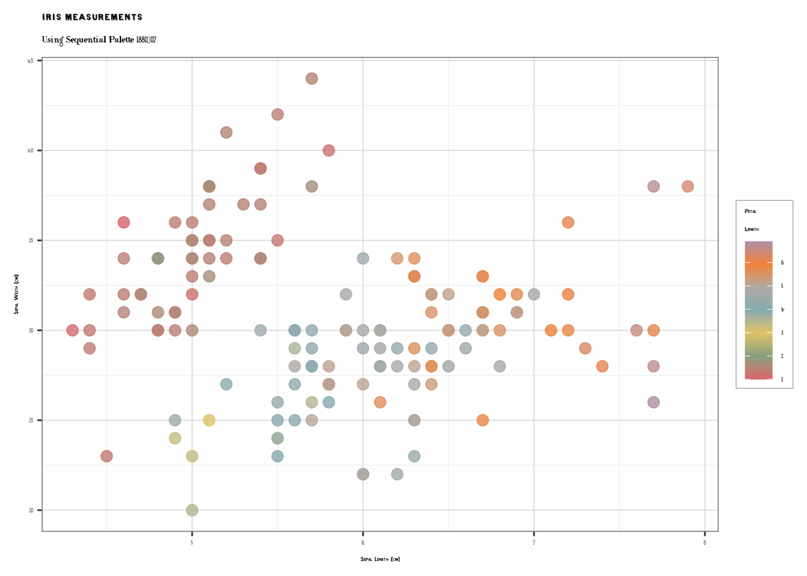
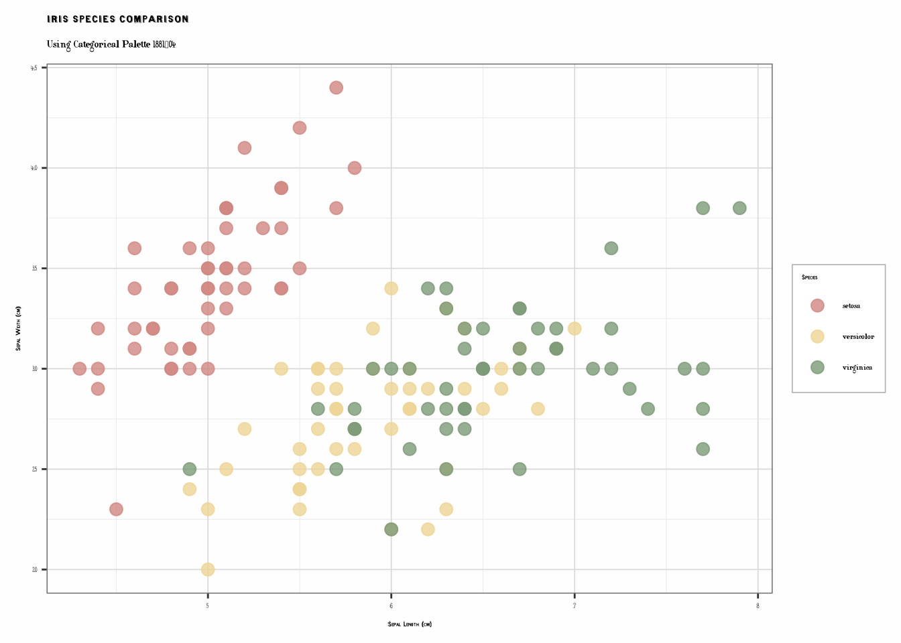
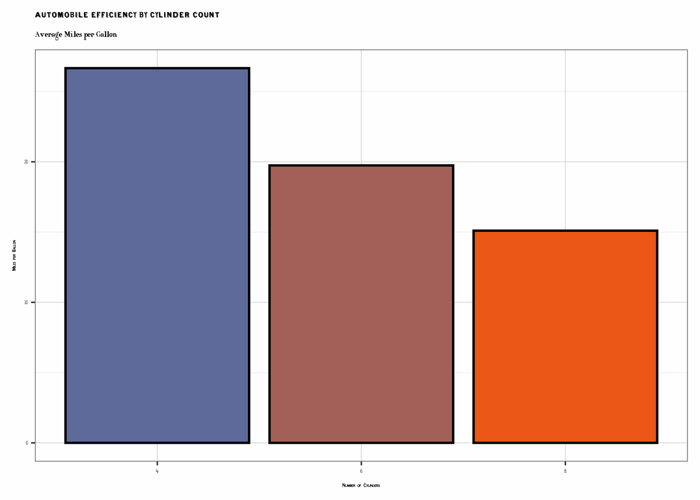
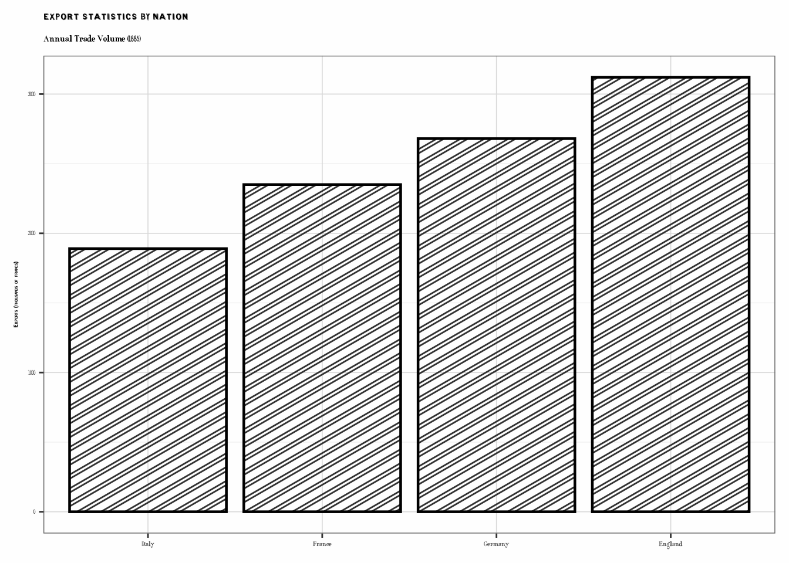
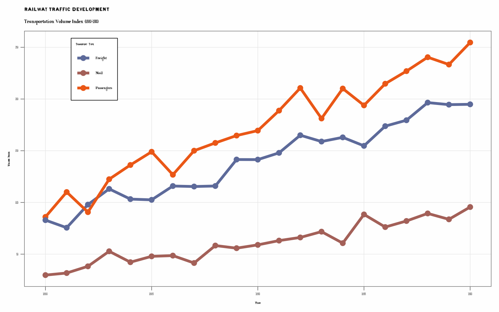
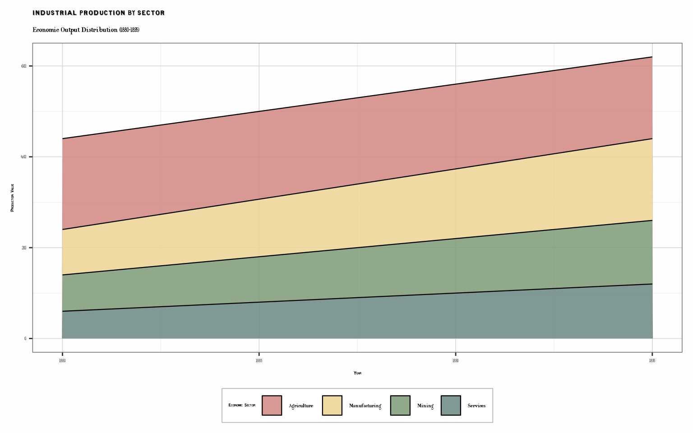
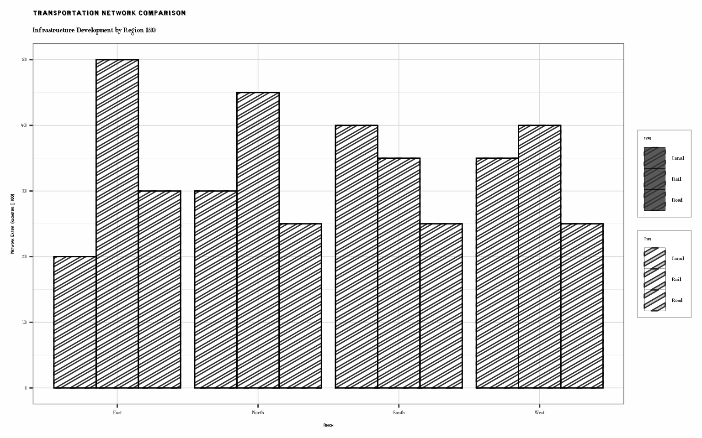
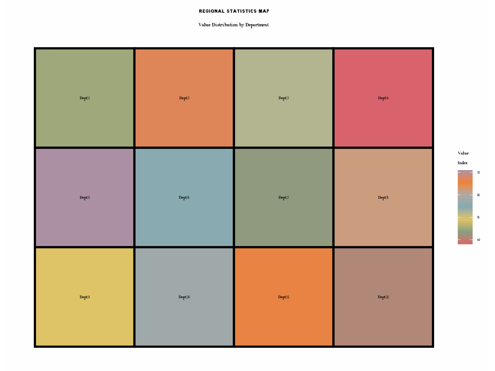
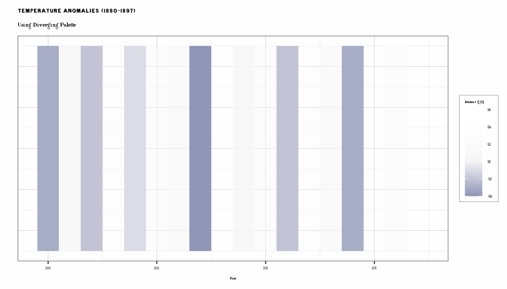

# Getting Started with ggCheysson

## Introduction

The `ggCheysson` package brings the distinctive visual style of Émile
Cheysson’s *Albums de Statistique Graphique* (1879-1897) to modern R
graphics. This vignette demonstrates how to use the package’s main
features:

- **Color palettes**: 20 authentic palettes from the original Albums
- **Hatching patterns**: Historical fill patterns for ggpattern
- **Fonts**: Five hand-drawn font families
- **Themes**: Period-appropriate ggplot2 themes

``` r
library(ggCheysson)
library(ggplot2)
```

## Loading Fonts

For vignettes and documents, we recommend using the `showtext` method:

``` r
# Load Cheysson fonts
load_cheysson_fonts(method = "showtext")
showtext::showtext_auto()
```

## Color Palettes

The package includes 20 color palettes organized into four types:

``` r
# View all available palettes
head(list_cheysson_pals(), 10)
#>       name       type album plate n_colors
#> 1  1880_07   category  1880     7        7
#> 2  1881_03 sequential  1881     3        1
#> 3  1881_04   category  1881     4        4
#> 4  1881_08    grouped  1881     8        5
#> 5  1882_04    grouped  1882     4        2
#> 6  1883_04  diverging  1883     4        2
#> 7  1883_06   category  1883     6        4
#> 8  1883_07  diverging  1883     7        3
#> 9  1886_04 sequential  1886     4        2
#> 10 1886_07   category  1886     7        3

# View palettes by type
list_cheysson_pals("sequential")
#>      name       type album plate n_colors
#> 1 1881_03 sequential  1881     3        1
#> 2 1886_04 sequential  1886     4        2
#> 3 1888_05 sequential  1888     5        1
#> 4 1891_06 sequential  1891     6        1
#> 5 1891_07 sequential  1891     7        2
#> 6 1895_04 sequential  1895     4        3
#> 7 1900_06 sequential  1900     6        2
list_cheysson_pals("category")
#>      name     type album plate n_colors
#> 1 1880_07 category  1880     7        7
#> 2 1881_04 category  1881     4        4
#> 3 1883_06 category  1883     6        4
#> 4 1886_07 category  1886     7        3
#> 5 1906_04 category  1906     4        4
#> 6 1906_06 category  1906     6        6
```

### Scatterplot with Sequential Palette

``` r
# Create data with continuous variable
data(iris)

p1 <- ggplot(iris, aes(Sepal.Length, Sepal.Width, color = Petal.Length)) +
  geom_point(size = 3, alpha = 0.8) +
  scale_color_cheysson("1880_07", discrete = FALSE) +
  labs(
    title = "Iris Measurements",
    subtitle = "Using Sequential Palette 1880_07",
    x = "Sepal Length (cm)",
    y = "Sepal Width (cm)",
    color = "Petal\nLength"
  ) +
  theme_cheysson()

print(p1)
```



### Scatterplot with Categorical Palette

``` r
p2 <- ggplot(iris, aes(Sepal.Length, Sepal.Width, color = Species)) +
  geom_point(size = 3, alpha = 0.8) +
  scale_color_cheysson("1881_04") +
  labs(
    title = "Iris Species Comparison",
    subtitle = "Using Categorical Palette 1881_04",
    x = "Sepal Length (cm)",
    y = "Sepal Width (cm)"
  ) +
  theme_cheysson()

print(p2)
```



## Bar Charts with Patterns

The package integrates with `ggpattern` to recreate Cheysson’s
distinctive hatching patterns.

``` r
# Simple bar chart with colors only
data(mtcars)
cyl_summary <- aggregate(mpg ~ cyl, data = mtcars, FUN = mean)
cyl_summary$cyl <- factor(cyl_summary$cyl)

p3 <- ggplot(cyl_summary, aes(cyl, mpg, fill = cyl)) +
  geom_col(color = "black", linewidth = 0.8) +
  scale_fill_cheysson("1883_04") +
  labs(
    title = "Automobile Efficiency by Cylinder Count",
    subtitle = "Average Miles per Gallon",
    x = "Number of Cylinders",
    y = "Miles per Gallon"
  ) +
  theme_cheysson() +
  theme(legend.position = "none")

print(p3)
```



``` r
# Bar chart with patterns
if (requireNamespace("ggpattern", quietly = TRUE)) {
  library(ggpattern)

  trade_data <- data.frame(
    country = c("France", "England", "Germany", "Italy"),
    exports = c(2350, 3120, 2680, 1890)
  )

  p4 <- ggplot(trade_data, aes(reorder(country, exports), exports, fill = country)) +
    geom_col_pattern(
      aes(pattern_type = country, pattern_fill = country),
      pattern = "stripe",
      pattern_density = 0.3,
      pattern_spacing = 0.025,
      color = "black",
      linewidth = 0.8
    ) +
    scale_fill_cheysson_pattern("1881_03") +
    scale_pattern_fill_cheysson("1881_03") +
    scale_pattern_type_cheysson("1881_03") +
    labs(
      title = "Export Statistics by Nation",
      subtitle = "Annual Trade Volume (1885)",
      x = NULL,
      y = "Exports (thousands of francs)"
    ) +
    theme_cheysson() +
    theme(legend.position = "none")

  print(p4)
}
```



## Line Graphs: Time Series

``` r
# Create time series data
years <- 1880:1900
railway_data <- data.frame(
  year = rep(years, 3),
  type = rep(c("Passengers", "Freight", "Mail"), each = length(years)),
  volume = c(
    seq(100, 250, length.out = 21) + rnorm(21, 0, 10),
    seq(80, 200, length.out = 21) + rnorm(21, 0, 8),
    seq(30, 90, length.out = 21) + rnorm(21, 0, 5)
  )
)

p5 <- ggplot(railway_data, aes(year, volume, color = type)) +
  geom_line(linewidth = 1.5) +
  geom_point(size = 2.5) +
  scale_color_cheysson("1883_04") +
  labs(
    title = "Railway Traffic Development",
    subtitle = "Transportation Volume Index (1880-1900)",
    x = "Year",
    y = "Volume Index",
    color = "Transport Type"
  ) +
  theme_cheysson_minimal() +
  theme(
    legend.position = c(0.15, 0.85),
    legend.background = element_rect(fill = "white", color = "black")
  )

print(p5)
```



## Stacked Area Chart

``` r
# Stacked area for composition over time
industry_data <- data.frame(
  year = rep(1880:1895, 4),
  sector = rep(c("Manufacturing", "Mining", "Agriculture", "Services"), each = 16),
  value = c(
    seq(100, 180, length.out = 16),
    seq(80, 140, length.out = 16),
    seq(200, 180, length.out = 16),
    seq(60, 120, length.out = 16)
  )
)

p6 <- ggplot(industry_data, aes(year, value, fill = sector)) +
  geom_area(alpha = 0.85, color = "black", linewidth = 0.4) +
  scale_fill_cheysson("1881_04") +
  labs(
    title = "Industrial Production by Sector",
    subtitle = "Economic Output Distribution (1880-1895)",
    x = "Year",
    y = "Production Value",
    fill = "Economic Sector"
  ) +
  theme_cheysson() +
  theme(legend.position = "bottom")

print(p6)
```



## Faceted Plots: Small Multiples

``` r
# Regional comparison using facets
set.seed(42)
regional_data <- data.frame(
  region = rep(c("Paris", "Lyon", "Marseille", "Bordeaux"), each = 20),
  year = rep(1880:1899, 4),
  population = c(
    seq(2200, 2900, length.out = 20) + rnorm(20, 0, 50),
    seq(400, 550, length.out = 20) + rnorm(20, 0, 20),
    seq(350, 490, length.out = 20) + rnorm(20, 0, 25),
    seq(250, 380, length.out = 20) + rnorm(20, 0, 15)
  )
)

p7 <- ggplot(regional_data, aes(year, population)) +
  geom_area(fill = "#d18781", alpha = 0.6) +
  geom_line(color = "#7c9a77", linewidth = 1.2) +
  facet_wrap(~region, ncol = 2, scales = "free_y") +
  labs(
    title = "Urban Population Growth",
    subtitle = "Major French Cities (1880-1899)",
    x = "Year",
    y = "Population (thousands)"
  ) +
  theme_cheysson() +
  theme(
    strip.background = element_rect(fill = "#edd493", color = "black"),
    strip.text = element_text(size = 11, face = "bold")
  )

print(p7)
```


## Grouped Bar Chart with Patterns

``` r
if (requireNamespace("ggpattern", quietly = TRUE)) {
  # Infrastructure comparison
  infrastructure <- data.frame(
    region = rep(c("North", "South", "East", "West"), each = 3),
    type = rep(c("Rail", "Canal", "Road"), 4),
    length = c(
      450, 300, 250,  # North
      350, 400, 250,  # South
      500, 200, 300,  # East
      400, 350, 250   # West
    )
  )

  p8 <- ggplot(infrastructure, aes(region, length, fill = type)) +
    geom_col_pattern(
      aes(pattern_type = type, pattern_fill = type),
      pattern = "stripe",
      position = "dodge",
      pattern_density = 0.35,
      pattern_spacing = 0.02,
      color = "black",
      linewidth = 0.5
    ) +
    scale_fill_cheysson_pattern("1881_03") +
    scale_pattern_fill_cheysson("1881_03") +
    scale_pattern_type_cheysson("1881_03") +
    labs(
      title = "Transportation Network Comparison",
      subtitle = "Infrastructure Development by Region (1890)",
      x = "Region",
      y = "Network Extent (kilometers × 100)",
      fill = "Type",
      pattern_type = "Type"
    ) +
    theme_cheysson() +
    theme(legend.position = "right")

  print(p8)
}
```



## Map-Style Visualization

``` r
# Simulated geographic data (dept-level statistics)
set.seed(123)
departments <- data.frame(
  dept = paste0("Dept_", 1:12),
  x = c(1, 2, 3, 4, 1, 2, 3, 4, 1, 2, 3, 4),
  y = c(3, 3, 3, 3, 2, 2, 2, 2, 1, 1, 1, 1),
  value = c(45, 67, 52, 38, 71, 55, 43, 62, 49, 58, 66, 41)
)

p9 <- ggplot(departments, aes(x, y, fill = value)) +
  geom_tile(color = "black", linewidth = 1.2) +
  geom_text(aes(label = dept), size = 3.5, fontface = "bold") +
  scale_fill_cheysson("1880_07", discrete = FALSE) +
  coord_equal() +
  labs(
    title = "Regional Statistics Map",
    subtitle = "Value Distribution by Department",
    fill = "Value\nIndex"
  ) +
  theme_cheysson_map()

print(p9)
```



## Exploring Different Palette Types

### Diverging Palette

``` r
# Show temperature anomalies with diverging palette
temp_data <- data.frame(
  year = 1880:1897,
  anomaly = c(-0.3, 0.1, -0.2, 0.4, -0.1, 0.3, 0.2, -0.4, 0.5,
              0.1, 0.3, -0.2, 0.4, 0.2, -0.3, 0.5, 0.3, 0.6)
)

p10 <- ggplot(temp_data, aes(year, 1, fill = anomaly)) +
  geom_tile(height = 0.5) +
  scale_fill_gradient2(
    low = cheysson_pal("diverging")[[1]][1],
    mid = "#f5f5f5",
    high = cheysson_pal("diverging")[[1]][5],
    midpoint = 0
  ) +
  labs(
    title = "Temperature Anomalies (1880-1897)",
    subtitle = "Using Diverging Palette",
    x = "Year",
    y = "",
    fill = "Anomaly (°C)"
  ) +
  theme_cheysson() +
  theme(
    axis.text.y = element_blank(),
    axis.ticks.y = element_blank()
  )

print(p10)
```



## Summary

The ggCheysson package provides:

- **20 color palettes** in 4 types (sequential, diverging, grouped,
  category)
- **83 pattern specifications** for ggpattern integration
- **5 font families** for authentic period styling
- **3 complete themes** for different visualization needs

### Key Functions

- [`scale_color_cheysson()`](https://friendly.github.io/ggCheysson/reference/scale_cheysson.md)
  /
  [`scale_fill_cheysson()`](https://friendly.github.io/ggCheysson/reference/scale_cheysson.md) -
  Apply color palettes
- `scale_pattern_*_cheysson()` - Apply pattern fills
- [`theme_cheysson()`](https://friendly.github.io/ggCheysson/reference/theme_cheysson.md) -
  Complete Cheysson theme
- [`load_cheysson_fonts()`](https://friendly.github.io/ggCheysson/reference/load_cheysson_fonts.md) -
  Load font families

### Available Palettes

``` r
# Count by type
table(sapply(cheysson_palettes, function(x) x$type))
#> 
#>   category  diverging    grouped sequential 
#>          6          2          5          7
```

For more details, see the [package
documentation](https://friendly.github.io/ggCheysson/) and visit David
Rumsey’s [Albums de Statistique
Graphique](https://www.davidrumsey.com/luna/servlet/view/search?q=album+de+statistique)
collection.
